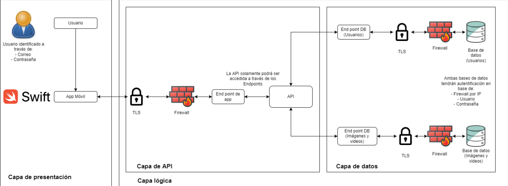

# Aplicación iOS de Lenguaje de Señas

## Descripción del proyecto
El proyecto consiste en el desarrollo de un prototipo de una aplicación para iOS para el aprendizaje de lenguaje de señas mexicano a través de lecciones y exámenes. La aplicación se esta desarrollando a la mano con la compañía "John Deere". 

La aplicación se esta desarrollando en el lenguaje **"Swift"** para dispositivos iOS, a la mando de una base de datos en **Firebase**. El desarrollo se esta realizando en el IDE **"XCode 13"**, exclusivo para dispositivos con MacOS.

Al final del desarrollo del proyecto se entregará un prototipo completo, el cual contará con todos los aditamentos adicionales para el uso y mantenimiento de la aplicación, como bases de datos, medios de comunicación, protocolos de seguridad, etc.

También se contará con una documentación extensa y detallada, tanto para el uso de la aplicación desde el punto de vista de varios usuarios en la forma de un manual de usuario, como la descripción del funcionamiento interno de la aplicación y sus componentes

  

## Instrucciones 
## Autores: 
### - Equipo: Relámpagos Marquinhos
-  Mauricio Cuadros A01236054
-  Jorge Daniel Cruz A01634536
-  Carlos Alejandro Morales A00830435
-  Rodolfo Maximiliano Jáuregui A01570673
### ¿Cómo visuaizar y editar el proyecto?
Es necesario tener una mac con Xcode instalado y abrir este proyecto. 

### Creado por Equipo Relámpagos Marquinhos:
#### Mauricio Cuadros, Jorge Cruz, Alejandro Morales y Maximiliano Jáuregui
